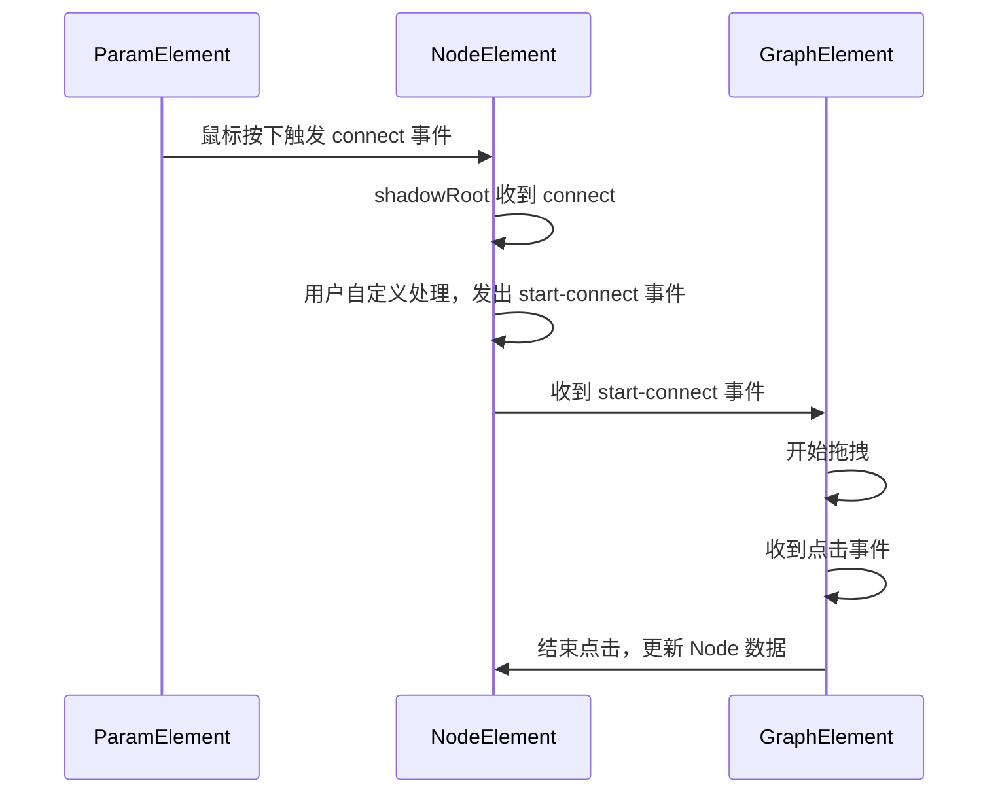

# UI Graph

Graph 图组件

图组件是一个较为复杂的 UI 组件，主要用于制作流程图、框架图、组织架构图等的基础组件。

为了满足多种图的需求，我们需要确定出公共功能，将这些功能组合到 Graph 内。通过对上述功能的调研，我们拆分出了以下功能点：

1. 基础 Viewer，允许移动、缩放、控制网格样式、背景样式
2. 基础 Node，允许选中（可控制）、移动、自定义内容、自定义输入输出参数
3. 基础 Node-Param，允许控制一个 Node 的输入/输出样式、位置、方向（例如参数在右侧，曲线需要先向右移动一定距离）
4. 基础 Line，允许选中（可控制）、自定义连线样式、自定义连线内容

## 概要

因为图是一个基础功能，从图里可以衍生出很多不同的业务场景，所以技术层面主要考虑可扩展性，满足未来定制需求。初期满足产品概要内的几种图形式。

目标：

- 满足未来多种 Graph 的显示（初期满足 animGraph、自定义材质编辑器、UML 类图需求）

  - 节点定制
    - [x] 输入/输出为横向的图
    - [x] 输入/输出为竖向的图
    - [x] 无输入输出的图
    - [x] 自定义图内节点的内容
    - [x] 自定义图内参数的样式、位置
    - [ ] 可选中节点
    - [ ] 框选节点
    - [x] 可控制节点可拖拽移动的区域
    - [ ] 可控制节点是否可选中

  - 连接线定制
    - [x] 自定义图内连接线的内容
    - [ ] 可选中连接线
    - [ ] 框选连接线
    - [x] 不同图允许不同的连接线规则（例如鼠标按下开始拖拽或者单击节点开始拖拽）
    - [ ] 可控制连接线是否可选中
    - [ ] 可定制多条连接线布局
    - [ ] 可控制是否允许新建连接线

- 性能验收指标
  - [x] 一个图内，同时显示 1k 个节点操作不卡顿
  - [x] 同屏显示 4 个 1k 节点的 Graph 不卡顿

- 其他功能
  - [x] 同一页面，显示多种不同 Graph
  - [x] 制作了一种 Graph 后，方便其他开发者使用定制好的 Graph
  - [ ] 子图嵌套

为了达到兼容各种图的目的，我们需要内置几个管理器：

1. Graph 管理器，可以预设 Graph，以及部分限制条件函数，设置好后，其他地方可以直接使用 type attribute，给数据就自动渲染成对应的图
2. NodeManager，给每种 Node 分配一个 Type，根据 Type 决定 Node 应该如何渲染，不同 Graph 类型需要隔离
3. LineManager，给每种 Line 分配一个 Type，根据 Type 决定 Line 应该如何渲染，不同 Graph 类型需要隔离

### 基础程序结构

### 基础渲染流程

### Node/Line 渲染流程

### 连接、操作流程

### 组件数据

Graph 需要的数据：

1. mesh 开关、间距、颜色
2. 0 点参考线开关、颜色、是否加粗 0 点
3. 是否可移动
4. 是否可缩放、最大/最小缩放比例

Node 需要的数据：

1. 相对 Graph 0 点的坐标
2. Node 自身的内容（template、style）
3. Node 携带的附加数据

Node-Param 需要的数据：

1. 连线方向限制
2. 输入 / 输出标记
3. 参数类型，用于显示是否可连接
4. 参数名字

Line 需要的数据：

1. Line 自身的内容（SVGElement）
2. Line 携带的附加数据
3. Line 起始点位置
4. Line 结束点位置

除了以上基础功能，还可以实现一些附加功能：

1. 自动布局，忽略 Node Position，根据图信息尝试自动布局
2. 多图混合互联
3. 子图嵌套