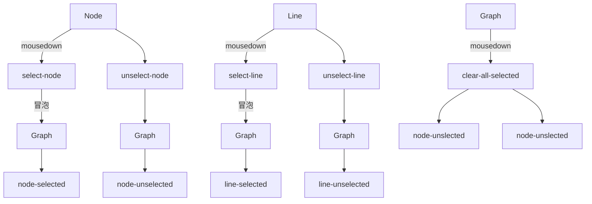

# 事件

这里统计所有通过 HTML 发送的事件

## 列表

主要分成了节点和线段两个类型，其中事件类型分成了 `内部` 和 `外部` 两个。

内部事件会发送到 graph 元素的 shadowRoot 上，不会传递到外部。

而外部事件，则直接从 graph 元素向上发送。

### Node

| 消息名 | 类型 | 说明 |
|----|----|----|
| node-added               | 通知 | 新增一个节点之后发出的消息
| node-changed             | 通知 | 修改一个节点之后发出的消息
| node-position-changed    | 通知 | 修改一个节点之后发出的消息
| node-removed             | 通知 | 删除一个节点之后发出的消息
| node-selected            | 通知 | 一个节点被选中的时候触发
| node-unselected          | 通知 | 一个节点被取消选中的时候触发
| node-connected           | 通知 | 确定用户操作准备连接一个节点
| select-node              | 内部 | 选中一个节点
| unselect-node            | 内部 | 取消选中一个节点
| clear-select-node        | 内部 | 取消选中所有节点
| move-node                | 内部 | 开始拖拽一个节点
| interrupt-move-node      | 内部 | 中断拖拽一个节点
| connect-node             | 内部 | 开始连接一个节点
| interrupt-connect-node   | 内部 | 中断连接一个节点

### Line

| 消息名 | 类型 | 说明 |
|----|----|----|
| line-added               | 通知 | 新增一个线段之后发出的消息
| line-changed             | 通知 | 修改一个线段之后发出的消息
| line-removed             | 通知 | 删除一个线段之后发出的消息
| line-selected            | 通知 | 一个线段被选中的时候触发
| line-unselected          | 通知 | 一个线段被取消选中的时候触发
| select-line              | 内部 | 选中一个线段
| unselect-line            | 内部 | 取消选中一个线段
| clear-select-line        | 内部 | 取消选中所有线段

